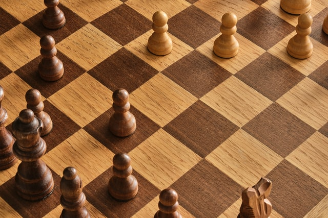

# Ashish Jain
*A Programming and Data Science enthusiast*
<!-- # TODO - Check the indentations as well as the notations in the readme file. A lot of work is required. -->
<!-- ## Sites open while editing this readme
- https://github.com/dataprofessor/Portfolio/blob/main/README.md
- https://www.youtube.com/watch?v=6NXLGP65S2Q
- https://www.youtube.com/watch?v=mEZ1Hj5yQ-8
- https://dataprofessor.github.io/Ken_Portfolio/ -->

**Link to portfolio site is right [here](https://aashishjain09.github.io/portfolio/)**

## CAREER OBJECTIVE
To get an opportunity of working with a fast paced and progressive company, where I can utilize my programming skills and technical background to the maximum.

## Education
- Bachelor of Technology [RTU-Kota] Jaipur Engineering College and Research Centre 2018 - 2022
  Electronics and Communications Engineering, *7.85 GPA / 10*
- High School [CBSE Board] Tagore International School, Jaipur
  12th - *86.2 %*
  10th - *10.0 CGPA / 10*

## Work Experience
### **REOMNIFY** | Data Engineering Intern
*Apr 25, 2021 – Jun 30, 2021*
* Collected HTML and API data from scraping websites and then storing them in relational SQL Database.
* Interacting with company founders, technology lead and colleagues on a daily basis.

### **DUKAAN** | Data Analyst Intern
*Oct 1, 2020 – Nov 5, 2020*
* Analyzing product details and images to categorize them for different online stores.
* Created a machine learning model to classify and organize product images.

## TRAINING
**SmartKnower** | Data Science Intern cum Trainee

*Feb 2021 – Mar 2021*

**COURSERA** | Python for Everybody - Specialization Certificate

*Apr 2020 – Jun 2020*

**COURSERA** | Google IT Automation with Python Professional Certificate

*Jun 2020 - Present*

**COURSERA** | IBM Data Science Professional Certificate

*Aug 2021 - Present*

## PROJECTS
### 1. Live CHESS game with AI Engine
A functional Chess game in which a player can play against another player or against Computer.

Photo by <a href="https://unsplash.com/@neon845b?utm_source=unsplash&utm_medium=referral&utm_content=creditCopyText">Jani Kaasinen</a> on <a href="https://unsplash.com/s/photos/chess?utm_source=unsplash&utm_medium=referral&utm_content=creditCopyText">Unsplash</a>

### 2. SmartKnower (Major Project)
Analysis and Display of Covid Data of different countries and prediction of future cases using ML models and Tableau

Photo by <a href="https://unsplash.com/@lukechesser?utm_source=unsplash&utm_medium=referral&utm_content=creditCopyText">Luke Chesser</a> on <a href="https://unsplash.com/s/photos/exploratory-data-analysis?utm_source=unsplash&utm_medium=referral&utm_content=creditCopyText">Unsplash</a>
  
### 3. Projects on Coursera:
   - Build a Web Scraping Bot to scrape links and store them in sqlite database
   - Build a Data Science Web App with StreamLit and Python
   - Use Wordpress to create a Blog for your Business
   - Data Visualization with Plotly Express
   - Linear Regression with NumPy and Python
